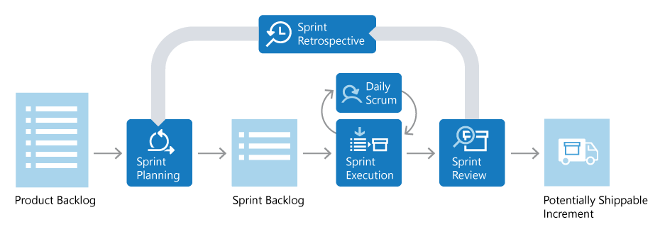

# Sistema de Reconocimiento Facial para Compras Inteligentes

## Descripción
Este proyecto tiene como objetivo desarrollar un sistema de reconocimiento facial que identifique a los clientes en una tienda y se conecte a una base de datos para verificar su saldo disponible y los productos que están comprando. Optimiza la experiencia de compra y la seguridad del proceso de pago mediante la autenticación facial.

## Integrantes del Equipo
- **Evanibaldo Rea Aviña** - Lider del proyecto
- **Juan José Hernández Olmos** - Desarrollo Backend
- **Juan Francisco Reyes Jasso** - Desarrollo de la Interfaz
- **Evanibaldo Rea Aviña** - Integración y Base de Datos

## Objetivo del Proyecto
Desarrollar un sistema basado en reconocimiento facial que identifique a los clientes en una tienda y se conecte a una base de datos para verificar su saldo disponible y los productos adquiridos. Esto permitirá agilizar el proceso de compra y mejorar la seguridad en los pagos.

## Alcance del Proyecto
1. **Autenticación del Cliente**: Identificación mediante reconocimiento facial.
2. **Conexión con la Base de Datos**: Consulta del saldo disponible y los productos comprados.
3. **Verificación de Saldo**: Validación de la capacidad de pago del cliente.
4. **Registro de Compras**: Almacenamiento de los productos adquiridos.
5. **Interfaz para Administradores**: Panel de control para la gestión de clientes, productos y ventas.
6. **Notificaciones y Alertas**: Avisos en caso de saldo insuficiente y opciones de pago alternativo.

## Requerimientos

### Requerimientos Funcionales
1. **Autenticación del Cliente**
   - Identificación del cliente mediante reconocimiento facial.
   - Acceso a su información financiera y de compras.
2. **Gestor de Compras**
   - Consulta de saldo antes de realizar una compra.
   - Registro automático de los productos adquiridos.
3. **Interfaz Administrativa**
   - Panel de gestión de clientes, productos y ventas.
   - Emisión de reportes de transacciones.
4. **Notificaciones**
   - Alertas por saldo insuficiente y sugerencia de métodos de pago.

### Requerimientos No Funcionales
1. **Seguridad**
   - Cifrado de datos para proteger la información del cliente.
2. **Escalabilidad**
   - Permitir la incorporación de nuevos clientes y productos sin afectar el rendimiento.
3. **Usabilidad**
   - Interfaz intuitiva para clientes y administradores.
4. **Rendimiento**
   - Identificación facial en menos de 5 segundos.
5. **Disponibilidad**
   - Operativo al menos el 80% del tiempo laboral.

## Fase de Desarrollo

Durante esta fase se han implementado todas las funcionalidades principales del sistema. A continuación, se detallan los componentes desarrollados, su estado actual y su propósito dentro del sistema.

### Reconocimiento facial
Se implementó un sistema de reconocimiento facial basado en imágenes previamente almacenadas por cliente. Cada cliente tiene una carpeta en el sistema (`faces/IDCliente/`) que contiene múltiples imágenes con diferentes ángulos y expresiones para aumentar la precisión. Estas imágenes son codificadas al iniciar el programa y comparadas en tiempo real al momento del pago. Este reconocimiento permite identificar al cliente sin requerir interacción manual.

### Base de datos y conexión
Se implementaron tres bases de datos independientes en SQL Server:
- **FM_Clientes**: Almacena el nombre del cliente y su saldo.
- **FM_Productos**: Contiene todos los productos disponibles con código, nombre, precio e inventario.
- **FM_Compras**: Preparada para registrar futuras compras por cliente.

El sistema se conecta automáticamente a las bases mediante el archivo `conexion.py` y obtiene datos en tiempo real al ejecutar acciones dentro del sistema (como escanear productos o consultar saldo).

### Carga dinámica de productos
Los productos se cargan desde la base de datos `FM_Productos` en lugar de estar definidos directamente en el código. Se implementó una función que lee todos los productos al iniciar el programa y permite agregarlos al carrito ingresando su código.

### Validación de saldo y pago
El cliente puede seleccionar la opción “Pagar con Face ID”, momento en el cual el sistema:
1. Verifica su rostro con la base de datos de imágenes.
2. Consulta su saldo en la base de datos.
3. Si el saldo es suficiente, descuenta el monto total de la compra.
4. Muestra un mensaje de confirmación y genera el ticket de compra.

Si no hay saldo suficiente, se muestra una alerta y no se permite continuar con el pago.

### Interfaz gráfica del sistema
La interfaz fue diseñada en `tkinter` y está compuesta por tres pantallas principales:
- **ProductPage**: Permite escanear productos, ver el carrito y proceder al pago.
- **PaymentPage**: Muestra el total a pagar y ofrece métodos como Face ID, tarjeta y QR.
- **TicketPage**: Genera un resumen de compra y permite guardar un ticket en formato `.txt`.

Los colores, botones y tipografías fueron ajustados para que la experiencia sea clara, moderna y accesible.

### Seguimiento SCRUM
Se utilizaron tableros tipo Kanban en GitHub Projects para llevar el control de tareas por sprint. Entre las tareas marcadas como completadas están:
- Captura y codificación de imágenes.
- Entrenamiento y pruebas del sistema de reconocimiento facial.
- Creación y conexión de bases de datos.
- Validación de saldo y ejecución de pagos.
- Generación de reportes visuales y tickets.

## Metodología de Desarrollo (SCRUM)
Se utilizó **SCRUM**, una metodología ágil que facilita la gestión de proyectos complejos mediante ciclos iterativos llamados sprints. Cada sprint tiene una duración fija, generalmente de dos semanas, y se enfoca en entregar incrementos funcionales del producto. Los componentes clave de SCRUM incluyen:

1. **Roles**
   - **Product Owner (Propietario del Producto)**: Gestiona el Product Backlog, priorizando las funcionalidades según el valor para el negocio.
   - **Scrum Master**: Facilita el proceso SCRUM, eliminando impedimentos y asegurando que el equipo siga las prácticas ágiles.
   - **Equipo de Desarrollo**: Grupo multidisciplinario responsable de construir el producto.

2. **Artefactos**
   - **Product Backlog**: Lista priorizada de requisitos y funcionalidades del producto.
   - **Sprint Backlog**: Conjunto de tareas seleccionadas del Product Backlog para el sprint actual.
   - **Incremento**: Resultado funcional entregable al final de cada sprint.

3. **Eventos**
   - **Sprint Planning**: Reunión para planificar el trabajo del próximo sprint.
   - **Daily Scrum**: Reunión diaria de 15 minutos para sincronizar al equipo.
   - **Sprint Review**: Revisión del incremento al final del sprint.
   - **Sprint Retrospective**: Reflexión sobre el proceso para identificar mejoras.

## Cronograma de actividades del proyecto
#### Kanban
https://github.com/users/Vaniirea/projects/1
#### Cronograma de Actividades
https://github.com/users/Vaniirea/projects/1/views/4

## Diagramas del Proyecto
#### Diagrama de Casos de Uso, Diagrama de Clases y Diagrama de Actividades
https://github.com/Vaniirea/Proyecto-FaceMarket/blob/main/Diagramas.md

#### Diagrama de BD
https://github.com/Vaniirea/Proyecto-FaceMarket/blob/main/DiagramaBD.md

## Código
